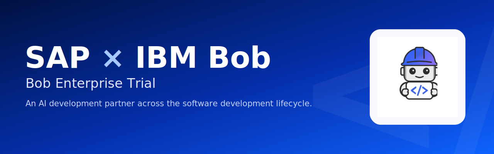
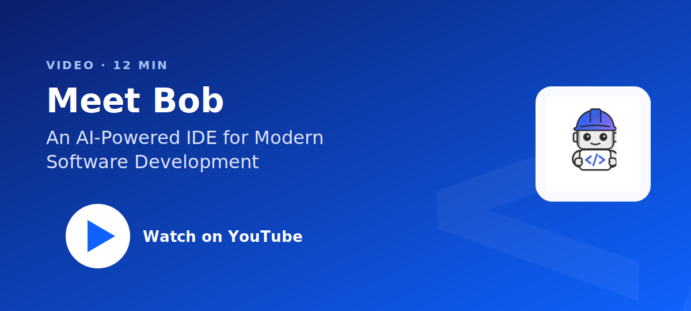

<p align="center">
  <a href="presentation/IBM-Bob-Intro.pdf">
    
  </a>
</p>

# SAP x IBM Bob 

 An AI coding partner that understands context and writes good code. Meet  [IBM Bob](https://bob.ibm.com/docs) your agentic partner across the SDLC.

1. Build a Galactic Travel Company through the tutorials
2. Learn AI development workflow optimizations
3. Work through labs to build skills
4. Meet weekly with IBMers to learn the latest from IBM Bob
5. Join the Bob AI Developer Community


---
<div align="center">

**Ready to transform your development workflow?**

[🚀 Install Bob Now](#setup) | [📚 View Resources](#watch-and-read) | [🧪 Try Labs](#labs)
</div>

## Setup

Bob ships as two surfaces — pick whichever fits theway you work. They share the same modes, MCP servers, checkpoints, rules, and skills, and the labs run in either.

**Bob IDE — standalone desktop app.** Best for whole-codebase work with a visual diff, file tree, and side-by-side edits. Available for macOS, Linux, and Windows. [Download Bob IDE](https://bob.ibm.com/docs/ide/getting-started/install) and sign in with your IBMid.

**Bob Shell (CLI) — terminal app.** Best for quick edits, scripting, CI, and headless workflows. Available for macOS, Linux, and Windows. Requires Node.js 22.15+.

```bash
# macOS / Linux
curl -fsSL https://bob.ibm.com/download/bobshell.sh | bash

# Windows (PowerShell)
powershell -ep Bypass 'irm -Uri "https://bob.ibm.com/download/bobshell.ps1" | iex'
```

Launch with `bob` and sign in with your IBMid. Already running Bob IDE? You can install the Shell from its command palette.

More on setup: [IDE Quickstart](https://bob.ibm.com/docs/ide/getting-started/quickstart) · [Bob Shell setup guide](https://bob.ibm.com/docs/shell/getting-started/install-and-setup).

---

## What Bob can do

<table>
<tr>
<td width="50%" valign="top">
&nbsp; <b><a href="https://bob.ibm.com/docs/ide/features/modes">Modes</a></b><br>
Route each task to Plan, Code, or Ask.
</td>
<td width="50%" valign="top">
&nbsp; <b><a href="https://bob.ibm.com/docs/ide/features/checkpoints">Stay in control</a></b><br>
Approve changes and roll back with checkpoints.
</td>
</tr>
<tr>
<td width="50%" valign="top">
&nbsp; <b><a href="https://bob.ibm.com/docs/ide/core-concepts/tools">MCP servers</a></b><br>
Connect Bob to your tools, data, and internal services.
</td>
<td width="50%" valign="top">
&nbsp; <b><a href="https://bob.ibm.com/docs">Bob Shell</a></b><br>
Run Bob from the terminal, including from non-interactive scripts.
</td>
</tr>
<tr>
<td width="50%" valign="top">
&nbsp; <b><a href="https://bob.ibm.com/docs/ide/security/bob-security-guidance">Shift-left security</a></b><br>
Scan for vulnerabilities and secrets as you code.
</td>
<td width="50%" valign="top">
&nbsp; <b><a href="https://bob.ibm.com/docs/ide/configuration/custom-modes">Rules, skills, custom modes</a></b><br>
Encode your team's standards so Bob follows them.
</td>
</tr>
</table>

More on Bob: [all features](https://bob.ibm.com/docs/ide) · [best practices](https://bob.ibm.com/docs/ide/getting-started/best-practices).


---

## Labs

Five labs, beginner to advanced. 

Read the main [IBM Bob on Tour repo](https://github.com/d-schreiter/Bob-On-Tour) for setup.

| Lab | What you build | Time |
|---|---|---|
| [Lab 0 — Getting started with Bob](https://github.com/d-schreiter/Bob-On-Tour/tree/main/lab0) | Familiarize youself with Bob's core features: Rules, Slash Commands, and Skills. | ~15 min |
| [Lab 1 — Build an app from a spec](https://github.com/d-schreiter/Bob-On-Tour/tree/main/lab1) | A full-stack app, using Plan and Code modes | ~45 min |
| [Lab 2 — Security & code analysis](https://github.com/d-schreiter/Bob-On-Tour/tree/main/lab2) | Fixes for SQL injection, XSS, and hardcoded secrets | ~60 min |
| [Lab 3 — Code translation](https://github.com/d-schreiter/Bob-On-Tour/tree/main/lab3) | A Python script ported to JavaScript | ~45 min |
| [Lab 4 — MCP server & custom mode](https://github.com/d-schreiter/Bob-On-Tour/tree/main/lab4) | Your own MCP server and a custom Bob mode | ~90 min |

Want more practice? The [IBM bob-demo catalog](https://github.com/IBM/bob-demo) has runnable demos for DevOps ([Ansible](https://github.com/IBM/bob-demo/blob/main/ansible-devops), [Tekton](https://github.com/IBM/bob-demo/blob/main/tekton-devops)), modernization ([EJB to Quarkus](https://github.com/IBM/bob-demo/blob/main/modernize-ejb-to-quarkus)), MCP ([legacy to MCP](https://github.com/IBM/bob-demo/blob/main/legacy-to-mcp)), and more. The tutorials use the [Galaxium Travels](https://github.com/IBM/galaxium-travels) demo app if you want a realistic codebase.

---

## Program and sessions

Each week pairs a lab with one live session and drop-in office hours.

| Week | Focus | Do | Live session | Date |
|---|---|---|---|---|
| 1 | Meet Bob & build | Install, Quickstart, Lab 1 | Kickoff | June 17, 9:30-10:30 CET |
| 2 | Understand & secure | Lab 2, shift-left scans | Security deep dive | June 24, 9:30-10:30 CET |
| 3 | Extend & automate | Lab 3, MCP, Bob Shell | MCP & modes workshop | July 1, 9:30-10:30 CET |
| 4 | Ship & scale | Lab 4, DevOps, your own codebase | Build clinic | July 8, 9:30-10:30 CET |
| 5 | Bob-a-thon | Build and demo in a team | Bob-a-thon at SAP Labs Walldorf | July 15, 9:30-10:30 CET |

**Office hours** run every week — drop in with a question or just to debug something live. Schedule and join links: [Office Hours](#office-hours).

Detailed Agenda coming soon...

---

## Watch and read

The 12-minute overview is the best place to start:

<p align="center">
  <a href="https://www.youtube.com/watch?v=dQw4w9WgXcQ">
    
  </a>
</p>

- Video — [Meet Bob: an AI-powered IDE](https://www.youtube.com/watch?v=dQw4w9WgXcQ) (12 min)
- Video - [IBM Dev Day Bob Edition Keynote](https://youtu.be/cpm8h18jWI8?si=KKQIqp5byrNPNhKI)
- Video — [Deep dive: prototype to scalable cloud deployment](https://www.youtube.com/watch?v=WQscA_YQey0)
- Channel — [IBM Bob on YouTube](https://www.youtube.com/@ibm-bob)
- Deck — [the kickoff deck (PDF)](presentation/IBM-Bob-Intro.pdf)
- Docs — [bob.ibm.com/docs](https://bob.ibm.com/docs)
- Community - Get access to the [IBM Bob developer community](https://community.ibm.com/community/user/groups/community-home?CommunityKey=300ac388-08f0-427e-a600-0199bfc9dd2a)

#### Getting started
- Installing: https://bob.ibm.com/docs/ide/getting-started/install
- Quickstart: https://bob.ibm.com/docs/ide/getting-started/quickstart
- Best practices: https://bob.ibm.com/docs/ide/getting-started/best-practices
- Tutorials: https://bob.ibm.com/docs/ide/getting-started/tutorials/introduction

#### Configuration & core concepts
- Custom modes: https://bob.ibm.com/docs/ide/configuration/custom-modes
- Custom rules: https://bob.ibm.com/docs/ide/configuration/rules
- Tools: https://bob.ibm.com/docs/ide/core-concepts/tools
- Context window management: https://bob.ibm.com/docs/ide/core-concepts/context-window-management

#### Account, security, enterprise
- Bobcoins (cost / consumption): https://bob.ibm.com/docs/ide/account/bobcoins
- Security guidance: https://bob.ibm.com/docs/ide/security/bob-security-guidance
- Enterprise overview: https://bob.ibm.com/docs/ide/enterprise/enterprise-index
- Troubleshooting: https://bob.ibm.com/docs/ide/troubleshooting


## Office Hours

Drop-in, no agenda required. Office hours run every week of the trial (Weeks 1 to 5) and are the fastest way to get unblocked and to learn AI development best practices.


#### Schedule

| Week | Day / time (CET) | Theme (optional) | Join |
|---|---|---|---|
| 1 | June 17, 9:30-10:30 CET | Setup & first build | [link](#) |
| 2 | June 24, 9:30-10:30 CET | Security & code analysis | [link](#) |
| 3 | July 1, 9:30-10:30 CET | MCP, Bob Shell & modes | [link](#) |
| 4 | July 8, 9:30-10:30 CET | Own-codebase clinic | [link](#) |
| 5 | July 15, 9:30-10:30 CET | Bob-a-thon support | [link](#) |

Themes are a default, not a gate. Bring any question, any week.

#### What office hours are for

- Debugging a lab or your own task
- Install, environment, or account issues
- Architecture sanity-checks ("how would Bob approach this?")
- Connecting an MCP server to your stack


#### Get the most out of it

- Bring your screen and a specific question. Working sessions beat abstract ones.
- Have the repo open in Bob so we can look at the actual context.
- Coming with just curiosity is fine too.

#### Can't make it?

- Post questions in the trial teams channel (TBD).
- Check out the [troubleshooting guide](https://bob.ibm.com/docs/ide/troubleshooting).
- Bob's own Ask mode is a good first responder.


---


Have a question, want to learn more, or interested in talking about AI trends email [Justin@IBM](mailto:justin.mccoy@us.ibm.com) : justin.mccoy@us.ibm.com

**Created with ❤️ using IBM Bob**
